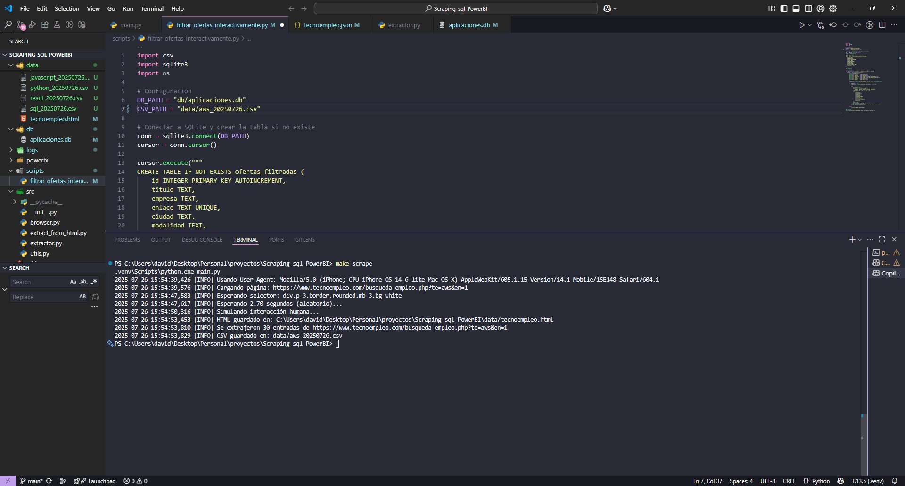
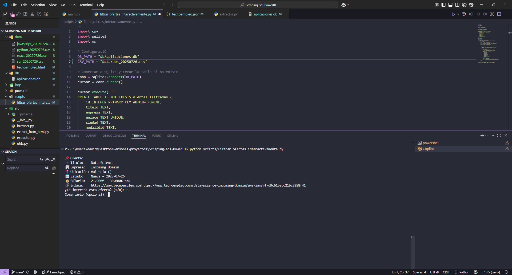
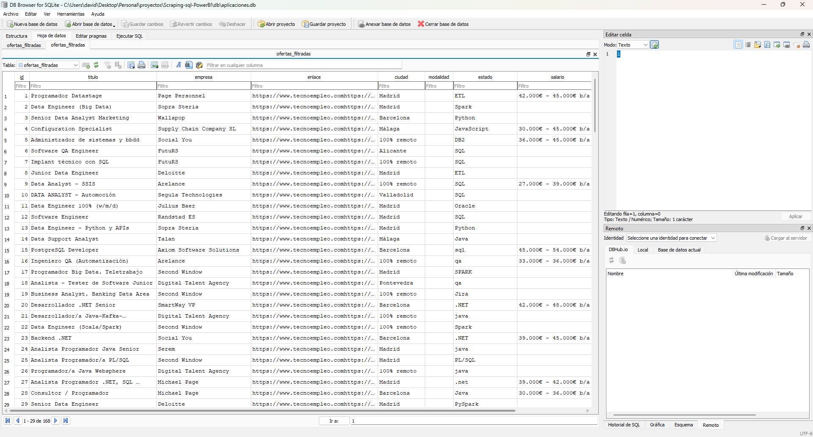
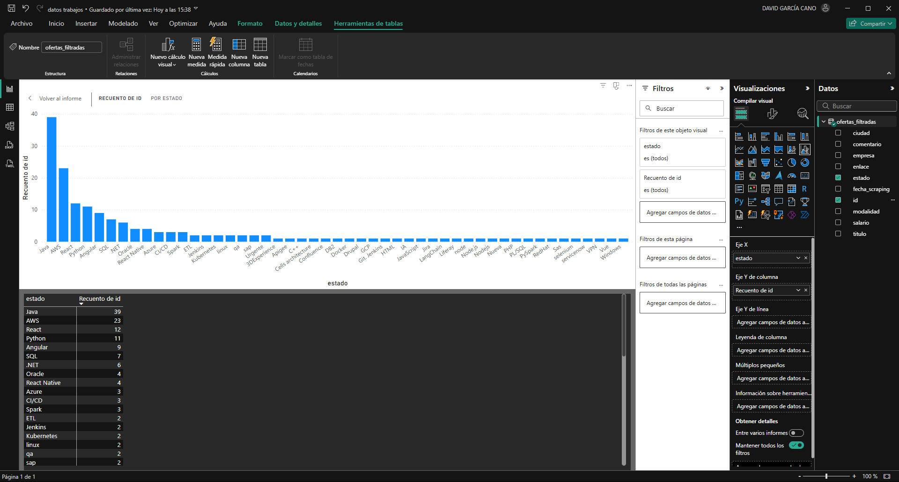
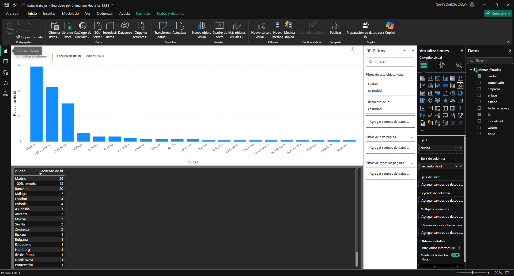

# 📊 Scraping + SQL + Power BI

Proyecto completo de automatización, análisis y visualización de ofertas de empleo técnicas, combinando scraping web, almacenamiento en base de datos SQLite y visualización con Power BI.

---

## 🚀 Tecnologías usadas

- **Python** – requests, BeautifulSoup, Playwright, sqlite3  
- **SQLite** – Base de datos local y consulta desde Power BI  
- **Power BI Desktop** – Visualización de datos  
- **VSCode + SQLite Explorer** (opcional)  
- **DB Browser for SQLite** – Visualización y edición de la base de datos  

---

## 📁 Estructura del proyecto

```
Scraping-sql-PowerBI/
│
├── data/                    # HTML, CSV y datos de scraping
│   ├── tecnoempleo.html
│   ├── python_20250726.csv
│   ├── …
│
├── db/                      # Base de datos SQLite
│   └── aplicaciones.db
│
├── config/                  # Configuración para cada scraping
│   └── tecnoempleo.json
│
├── scripts/                 # Scripts interactivos de filtrado
│   └── filtrar_ofertas_interactivamente.py
│
├── src/                     # Código fuente
│   ├── browser.py
│   ├── extractor.py
│   ├── extract_from_html.py
│   └── main.py
│
├── Makefile                 # Automatización de scraping
├── requirements.txt
└── README.md
```


## 🔄 Flujo de trabajo

1. **Scraping automático** de ofertas desde Tecnoempleo mediante Playwright  
   - Ejecuta `make scrape` o `python main.py`  
   - Genera HTML local y extrae datos enriquecidos  
2. **CSV personalizado**  
   - Nombre: `<keyword>_<YYYYMMDD>.csv`  
   - Campos: título, empresa, enlace, ciudad, modalidad, estado, salario, fecha_scraping  
3. **Filtrado interactivo**  
   - `python scripts/filtrar_ofertas_interactivamente.py`  
   - Revisa ofertas por consola y guarda solo las interesantes en `aplicaciones.db`  
4. **Almacenamiento en SQLite**  
   - Tabla `ofertas_filtradas` con esquema definido en `schema.sql`  
5. **Visualización con Power BI**  
   - Conectar a `db/aplicaciones.db` desde Power BI Desktop  
   - Crear gráficas de distribución por estado, ciudad, modalidad, salario, fecha…


## 📸 Pruebas de funcionamiento

### 1. Scraping automático por palabra clave  


### 2. Filtrado interactivo  


### 3. Base de datos en DB Browser  


### 4. Visualización en Power BI 
  
  



## 📦 Instalación & uso

```bash
# 1. Clona el repositorio y entra al directorio
git clone https://github.com/tuusuario/Scraping-sql-PowerBI.git
cd Scraping-sql-PowerBI

# 2. Crea un entorno virtual
python -m venv .venv

# 3. Actívalo
# En Windows
.venv\Scripts\activate
# En macOS/Linux
# source .venv/bin/activate

# 4. Instala las dependencias
pip install -r requirements.txt

# 5. Instala navegadores para Playwright
python -m playwright install
```

```bash
# 6. Ejecuta el scraping
make scrape
# o directamente:
python main.py
```

```bash
# 7. Filtra ofertas con el script interactivo
python scripts/filtrar_ofertas_interactivamente.py
```

```text
# 8. Configura tu búsqueda
Edita config/tecnoempleo.json y cambia los valores de:
- "url": para la búsqueda en Tecnoempleo
- "nombre_busqueda": para nombrar automáticamente el CSV generado
```

```text
# 9. Visualiza en Power BI
- Abrir Power BI Desktop
- Obtener datos → ODBC o SQLite
- Seleccionar: db/aplicaciones.db
- Cargar la tabla: ofertas_filtradas
- Construir visualizaciones por estado, ciudad, modalidad, etc.
```


## 🔍 Consultas SQL disponibles
-Puedes explorar los datos directamente desde Power BI o usando scripts SQL para análisis personalizados.

## 📬 Sobre mí

Este proyecto forma parte de mi portfolio como desarrollador de automatización y análisis de datos.  
Me interesa especialmente el scraping, la visualización con Power BI y la programación backend.

📧 Puedes contactarme en:  
**davidga276@gmail.com**

🔗 O visitar mi perfil de LinkedIn:  
[linkedin.com/in/davidgc17](https://www.linkedin.com/in/davidgc17)


